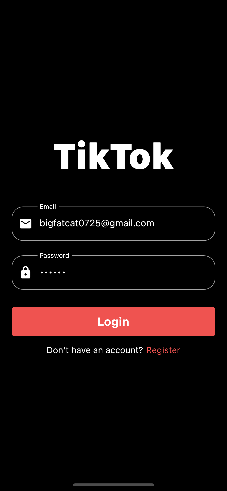

# flutter_tiktok

#### 진짜 박치기 하느라 어려웠는데 틱톡 쭉 클론코딩하면서 firebase 사용법과 자주 쓰이는 기능들을 배워간 것 같아 기분이 좋다.

- 이메일, 패스워드 로그인
- 프로필 사진, 이름, 이메일, 패스워드 회원가입
- 비디오 업로드
- 비디오 게시물 생성
- 게시물 좋아요 기능
- 게시물 코멘트 생성
- 게시물 코멘트 좋아요 기능
- 유저 검색
- 유저 검색 -> 프로필 -> 팔로우기능

